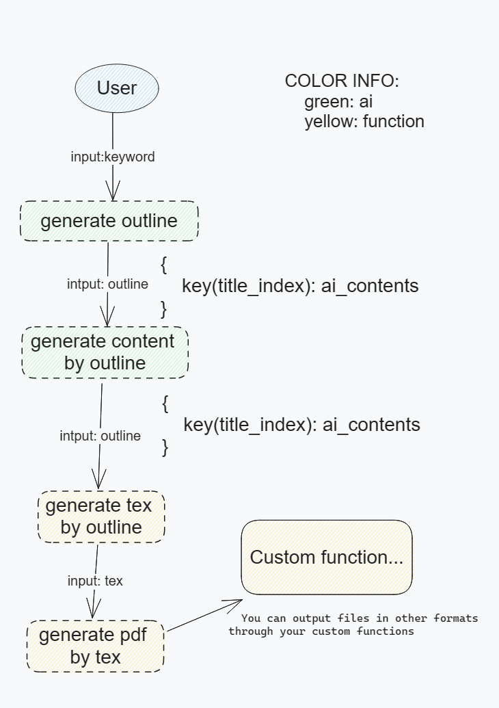

# AI2Paper

## 原理图


## 如何使用

### 1. 配置
你需要修改`config/config_template.json`为你自己的配置，然后将其重命名为`config.json`。
```json
{
  "Ernie": {
    "client_id": "",
    "client_secret": "",
    "access_token": ""
    },
  "Zhipu": {
    "api_key": ""
  },
  "Spark": {
    "api_secret": "",                                      
    "app_id": "",
    "api_key": ""
  },
  "MinIo": {
    "host": "",
    "port": "",
    "access_key": "",
    "secret_key": "",
    "bucket": "",
    "tmp_path": ""
  }
}
```

### 2. 运行
更改`main.py`的关键词,即可以生成想要的论文
```python
from service.ThesisService import generate_thesis

generate_thesis("管理学绩效制度")
```

```bash
python main.py
```

### 3. Linux
```shell
sudo apt-get install latexmk
```